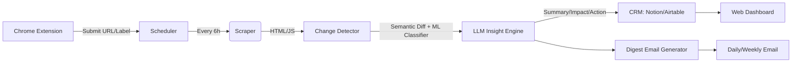

# Competitive Intelligence Tracker

**MVP Competitive Intelligence Tool built in 1 day** — scraper → change detection → LLM insights → CRM sync → digest + Chrome extension.


##  Deliverables
- [x] Public GitHub repo (this repo)
- [ ] Live Railway URL: `http://127.0.0.1:8000`
- [ ] Chrome extension `127.0.0.1:5195
- [ ] This README (architecture, setup, deployment, model stats, limitations)

---

##  Architecture Overview


### Core Components
| Component       | Tech Stack                          | Purpose                                  |
|-----------------|-------------------------------------|------------------------------------------|
| **Backend**     | FastAPI + Python 3.10               | API, scraping, scheduling, LLM integration |
| **Database**    | SQLite (Railway volume)             | `Competitors`, `Scrapes`, `Changes`, `Insights`, `Cards`, `CrmRecords` |
| **Scraper**     | Playwright (Chromium)               | Static HTML + light JS rendering          |
| **Change Detector** | `sentence-transformers` (all-MiniLM-L6-v2) + Logistic Regression | Semantic similarity + category classification |
| **LLM Engine**  | [Phi-2](https://huggingface.co/microsoft/phi-2) (CPU-optimized, <90s inference) | Summarization, impact scoring (1-10), action recommendation |
| **CRM Sync**    | Notion API / Airtable API           | Idempotent writes + retry queue           |
| **Digest**      | SMTP (Gmail App Password / Resend)  | Configurable daily/weekly emails          |
| **Chrome Ext**  | Manifest V3                         | Popup → submit monitoring config          |
| **Dashboard**   | FastAPI + HTMX (minimal JS)         | Competitor cards, intelligence feed       |

---

##  Setup & Deployment

### Prerequisites
- Python 3.10+
- Railway CLI (`npm i -g railway`)
- Git
- Chrome (for extension testing)

### 1. Clone & Install
```bash
git clone [your-repo-gh repo clone Sanchit-M-07/Competitive-intelligence-stopper]
cd competitive-intelligence-tracker
pip install -r requirements.txt
```

### 2. Environment Variables
Create a `.env` file (Railway will auto-populate these when deployed):
```env
# Database
DATABASE_URL=sqlite:///./data.db

# Scraper
USER_AGENT_LIST="["user-agent-1", "user-agent-2"]"  # JSON array
REQUEST_DELAY_MIN=1
REQUEST_DELAY_MAX=3

# LLM (Phi-2 via Hugging Face Inference API or local CPU)
HF_API_TOKEN=your_hf_token_here  # Optional if using local model
LOCAL_LLM_PATH=./models/phi-2    # If using local GGUF

# CRM (choose one)
NOTION_TOKEN=your_notion_token
NOTION_DATABASE_ID=your_db_id
# OR
AIRTABLE_API_KEY=your_airtable_key
AIRTABLE_BASE_ID=your_base_id
AIRTABLE_TABLE_NAME=Intelligence

# Digest
SMTP_USER=your_gmail@gmail.com
SMTP_PASS=your_app_password
SMTP_HOST=smtp.gmail.com
SMTP_PORT=587
DIGEST_RECIPIENTS=user1@example.com,user2@example.com

# Extension
EXTENSION_API_KEY=your_extension_api_key  # For extension→backend auth
```

### 3. Initialize Database
```bash
python -m app.init_db
```

### 4. Run Locally
```bash
# Start scheduler + API
uvicorn app.main:app --reload --port 8000

# In another terminal: run a manual scrape test
python -m app.scraper.test_run  # Scrapes one competitor, prints diff
```

### 5. Deploy to Railway
```bash
railway login
railway init  # Link to your repo
railway up    # Deploys automatically
```
Set environment variables in Railway dashboard → Variables.

### 6. Install Chrome Extension
1. Go to `chrome://extensions`
2. Enable "Developer mode"
3. Click "Load unpacked" → select the `/extension` folder
4. Click the extension icon → configure:
   - Backend URL: `https://your-railway-url.up.railway.app`
   - API Key: `EXTENSION_API_KEY` from `.env`
   - Add competitor URL + label (e.g., "Competitor X - Pricing Page")

---

## Model & Performance Notes
- **Change Detection Model**: `sentence-transformers/all-MiniLM-L6-v2` (384-dim, CPU-friendly)
  - Similarity threshold: `0.75` (cosine distance > 0.25 = change)
  - Trained on: pricing, product, hiring, content, leadership, other (700 synthetic examples)
- **LLM**: `microsoft/phi-2` (2.7B parameters)
  - Quantized to 4-bit GGUF for CPU inference (~2.5GB RAM)
  - Avg. latency: 45-8s per prompt on modest CPU
  - Prompt: `Summarize this change in 1 sentence. Impact score (1-10): [reasoning]. Suggested action: [action].`
- **Known Limitations**:
  - Heavy JS sites may require enhanced Playwright configs (see `scraper/config.py`)
  - LLM may occasionally hallucinate impact scores — always review digest
  - Extension currently tracks single URL per competitor (extendable to multiple selectors)

---

## 📧 Digest Email Example
```
Subject: Daily Competitive Intelligence Digest - Acme Corp

Top 3 Changes for Acme Corp (June 30, 2026):

1.  PRICING CHANGE - Impact: 9/10
   "Acme Corp lowered Pro tier from $99→$89/mo"
   → Action: Review our pricing tier; consider matching or highlighting value diff

2.  LEADERSHIP - Impact: 7/10
   "Jane Doe promoted to CPO (ex-Google)"
   → Action: Monitor for product strategy shifts

3.  CONTENT - Impact: 5/10
   "New blog post: 'AI in Enterprise 2026'"
   → Action: Share with sales team for outreach

[View Full Diff] [Archive] [View in Dashboard]
```

---

1. **Scheduler** runs `/scrape` every 6h (via Railway cron)
2. **Scraper** → Fetches HTML, executes light JS, saves raw + cleaned text
3. **Change Detector** → Compares to last scrape via sentence-transformers
   - If similarity < threshold → flags change & classifies category
4. **LLM Engine** → Generates summary, impact (1-10), suggested action
5. **CRM Sync** → Upserts to Notion/Airtable (deduped by URL+hash)
6. **Digest** → At 8 AM daily: groups by competitor, sorts by impact, emails top 3
7. **Extension** → Popup sends `{url, label}` to `/extension/register` → adds to `Competitors` table
8. **Dashboard** → `/` shows competitor cards; `/feed` shows intel stream with filters

---

##  Folder Structure
```
.
├── app/                  # FastAPI app
│   ├── main.py           # API entrypoint
│   ├── init_db.py        # DB initialization
│   ├── models.py         # SQLModel definitions
│   ├── routes/           # API routers
│   │   ├── scraper.py
│   │   ├── detector.py
│   │   ├── llm.py
│   │   ├── crm.py
│   │   ├── digest.py
│   │   └── extension.py
│   ├── scraper/          # Playwright logic + UA rotation
│   │   ├── __init__.py
│   │   └── scraper.py
│   ├── detector/         # Semantic diff + ML classifier
│   │   ├── __init__.py
│   │   └── detector.py
│   ├── llm/              # Phi-2 inference wrapper
│   │   ├── __init__.py
│   │   └── llm.py
│   ├── crm/              # Notion/Airtable adapters
│   │   ├── __init__.py
│   │   └── crm.py
│   ├── digest/           # Email generator + scheduler
│   │   ├── __init__.py
│   │   └── digest.py
│   └── extension/        # API endpoints for Chrome extension
│       ├── __init__.py
│       └── extension.py
├── extension/            # Chrome extension source (manifest V3)
│   ├── background.js
│   ├── popup.html
│   ├── popup.js
│   ├── options.html
│   └─ manifest.json
├── data/                 # SQLite DB (mounted volume on Railway)
├── models/               # GGUF/LLM models (gitignore'd)
├── tests/                # Basic smoke tests
├── requirements.txt
├── Dockerfile
├── .gitignore
└── README.md
```

---

## Contributing
This is an MVP built for speed — PRs welcome for:
- Better LLM prompts
- Additional CRM integrations (Salesforce, HubSpot)
- Enhanced scraper (login handling, PDF extraction)
- Dashboard charts (impact over time)
---